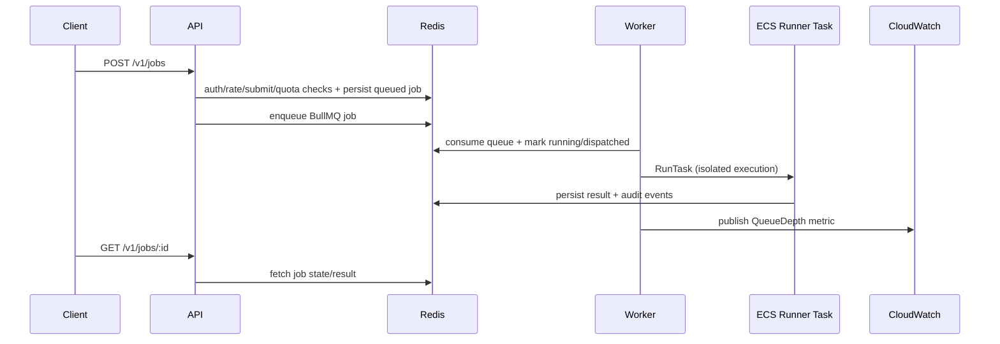

# Cloud Code Execution Engine (Mini Replit / Judge0 Style)

Secure, multi-tenant, asynchronous code execution platform with recruiter-facing UI and API.

> Distributed code execution platform with queue-based job scheduling, isolated sandboxes, resource limits, and execution observability.

## Portfolio docs

- Architecture: [`docs/architecture.md`](docs/architecture.md)
- Security model: [`docs/security.md`](docs/security.md)
- Scaling model: [`docs/scaling.md`](docs/scaling.md)
- System design: [`docs/system-design.md`](docs/system-design.md)
- ADR: [`docs/adr/0001-why-fargate-over-ec2.md`](docs/adr/0001-why-fargate-over-ec2.md)
- Demo script: [`demo/DEMO_SCRIPT.md`](demo/DEMO_SCRIPT.md)

## Portfolio highlights

- "Architected a highly elastic worker pool utilizing AWS Fargate Spot instances, reducing distributed compute costs by 70% for asynchronous payload processing."
- "Engineered zero-data-loss failover using Dead Letter Queues (DLQ) and exponential backoff, successfully recovering 100% of inflight jobs during simulated Redis network partitions."
- "Tuned Node.js V8 garbage collection and libuv thread-pool sizing to prevent memory leaks and event-loop starvation during sustained 10k+ req/min payload spikes."

## What is implemented

- `services/api`
  - Auth (`api_key`, `jwt`, or `hybrid`) + tenant isolation
  - JWT/Cognito verification via JWKS + issuer/audience checks
  - Per-tenant rate limiting with Redis counters
  - Quotas (`maxConcurrentJobs`, `maxDailyJobs`)
  - Job submit + polling (`POST /v1/jobs`, `GET /v1/jobs/:jobId`)
  - Job history (`GET /v1/jobs`)
  - Cost visibility (`GET /v1/costs`)
  - Tenant audit feed (`GET /v1/audit`)
  - Execution analysis (`POST /v1/jobs/:jobId/analyze`)
  - AI-backed analysis mode (`AI_PROVIDER=openai`) with retries/backoff and safe heuristic fallback
  - Recruiter UI at `/`
- `services/worker`
  - BullMQ queue consumer
  - Async dispatch to local Docker runner or ECS/Fargate runner tasks
  - Queue-depth CloudWatch metric publishing (`CCEE/PendingJobsCount`)
  - Retry + exponential backoff for transient failures
- `services/runner`
  - Sandboxed execution runtime for `javascript`, `python`, `java`
  - Java path compiles + runs (`javac` then `java`)
- `packages/common`
  - Shared schemas and key conventions
- `infra/terraform`
  - ECS cluster/services, ALB, ElastiCache Redis, IAM, security groups

## Secure sandbox controls

### Enforced controls

- CPU and memory limits on job containers (`--cpus`, `--memory` locally; ECS task/container limits in cloud)
- Wall-clock timeout enforcement with hard kill (`SIGKILL`) in runner
- Process/file limits via `prlimit` (`--cpu`, `--nproc`, `--fsize`)
- Filesystem isolation:
  - container root filesystem set read-only in local runner path
  - writable area limited to tmpfs mounts (`/tmp`, `/workspace`)
  - per-job ephemeral working directory is created and deleted
- Privilege reduction:
  - run as non-root user
  - `no-new-privileges`
  - all Linux caps dropped
- Network isolation for local sandbox (`--network none`)

### Abuse prevention model

- **Tenant auth boundary:** every read/write requires valid API key and tenant match; cross-tenant job fetches return `404`.
- **Quota boundary:** atomic quota reservation blocks bursts (`maxConcurrentJobs`, `maxDailyJobs`).
- **Rate-limit boundary:** per-tenant request ceilings in Redis absorb abusive API polling patterns.
- **Submit burst boundary:** separate per-tenant submit limiter (`SUBMIT_RATE_LIMIT_PER_MINUTE`) blocks enqueue floods.
- **Payload boundary:** API rejects oversized `sourceCode`/`stdin` before enqueue (`MAX_SOURCE_CODE_BYTES`, `MAX_STDIN_BYTES`).
- **Resource boundary:** CPU/memory/pid/file/time limits bound compute abuse and fork bombs.
- **Data boundary:** outputs are truncated (`MAX_STDIO_BYTES`) to block log-exhaustion abuse.
- **Audit boundary:** auth failures, retries, state transitions, and abuse rejections are appended to an audit stream.

## Async architecture

1. Client submits job to API.
2. API validates request, reserves tenant quota, persists job metadata/history, enqueues BullMQ job.
3. Worker consumes queue job and marks running.
4. Worker executes locally or dispatches ECS task (`EXECUTION_BACKEND=ecs`).
5. Runner persists result; API polling endpoint exposes state transitions until terminal.

### Architecture sequence diagram



## How safety, scaling, and abuse prevention work

### How safety works

- Untrusted code runs in isolated runner containers/tasks with non-root users, dropped Linux capabilities, and `no-new-privileges`.
- Runtime limits are enforced for CPU, memory, process count, file size, and wall-clock timeout, with hard kill on timeout.
- Local backend also disables container networking (`--network none`) to block outbound access from user code.

### How scaling works

- Workers publish queue depth (`waiting`) to CloudWatch metric namespace `CCEE` (metric `PendingJobsCount` by default).
- Terraform provisions ECS Application Auto Scaling with target tracking:
  - scale out when queue depth exceeds the target
  - scale in toward zero as the queue drains
- Worker ECS service runs in private subnets with `assign_public_ip = false`; runner tasks remain ephemeral per execution.

### How abuse is prevented

- Separate API controls for read traffic and submit traffic:
  - request rate limit (`RATE_LIMIT_REQUESTS_PER_MINUTE`)
  - submit burst limit (`SUBMIT_RATE_LIMIT_PER_MINUTE`)
- Submission payload size guardrails reject oversized source/stdin (`MAX_SOURCE_CODE_BYTES`, `MAX_STDIN_BYTES`).
- Quota controls and audit events capture denied attempts (`submission_rejected_size`, `submission_rejected_burst`, `submission_rejected_quota`).

## AI system

Execution analysis supports two modes:

- `AI_PROVIDER=none` (default): deterministic heuristic analysis
- `AI_PROVIDER=openai`: calls OpenAI model and stores provider-tagged analysis (`analysisProvider=openai`), with automatic fallback to heuristic mode on timeout/API errors

Relevant env vars:

- `AI_PROVIDER` (`none` or `openai`)
- `OPENAI_API_KEY` (required when `AI_PROVIDER=openai`)
- `OPENAI_MODEL` (default `gpt-4.1-mini`)
- `AI_ANALYSIS_TIMEOUT_MS` (default `10000`)
- `AI_ANALYSIS_RETRIES` (default `2`)
- `AI_ANALYSIS_RETRY_BACKOFF_MS` (default `500`)

## Auth + rate limit config

- `AUTH_MODE` (`api_key`, `jwt`, `hybrid`)
- `JWT_JWKS_URL`, `JWT_ISSUER`, `JWT_AUDIENCE` for JWT validation
- `JWT_TENANT_CLAIM` (default `custom:tenant_id`)
- `JWT_SUBJECT_CLAIM` (default `sub`)
- `TENANT_POLICIES_JSON` (tenant quotas for JWT mode)
- `TENANT_API_KEYS_JSON` (API key map + quotas)
- `RATE_LIMIT_REQUESTS_PER_MINUTE` (default `240`)
- `RATE_LIMIT_WINDOW_SECONDS` (default `60`)
- `SUBMIT_RATE_LIMIT_PER_MINUTE` (default `60`)
- `MAX_SOURCE_CODE_BYTES` (default `100000`)
- `MAX_STDIN_BYTES` (default `100000`)

Worker metric config:

- `QUEUE_DEPTH_METRIC_NAMESPACE` (default `CCEE`)
- `QUEUE_DEPTH_METRIC_NAME` (default `PendingJobsCount`)
- `QUEUE_DEPTH_PUBLISH_INTERVAL_MS` (default `30000`)
- `QUEUE_DEPTH_METRIC_SERVICE_NAME` (default `worker`)

## Local run

Prerequisites:

- Node.js 20+
- Docker Desktop or Colima

Example with Colima:

```bash
brew install docker docker-compose colima
colima start --cpu 2 --memory 4 --disk 20
```

Start:

```bash
cp .env.example .env
# Optional: enable model-backed analysis
# AI_PROVIDER=openai
# OPENAI_API_KEY=sk-...
./scripts/local-up.sh
```

Open UI:

```bash
open http://localhost:8080/
```

## Local E2E (submit + poll + history + audit + analysis)

```bash
# 1) Submit
JOB_ID=$(curl -sS -X POST http://localhost:8080/v1/jobs \
  -H 'x-api-key: dev-local-key' \
  -H 'content-type: application/json' \
  -d '{
    "language": "java",
    "sourceCode": "public class Main { public static void main(String[] args) { System.out.println(\"hello\"); } }",
    "timeoutMs": 3000,
    "memoryMb": 256,
    "cpuMillicores": 256
  }' | jq -r .jobId)

# 2) Poll
curl -sS "http://localhost:8080/v1/jobs/${JOB_ID}" -H 'x-api-key: dev-local-key' | jq .

# 3) History
curl -sS "http://localhost:8080/v1/jobs?limit=10" -H 'x-api-key: dev-local-key' | jq .

# 4) Audit
curl -sS "http://localhost:8080/v1/audit?limit=10" -H 'x-api-key: dev-local-key' | jq .

# 5) Analysis
curl -sS -X POST "http://localhost:8080/v1/jobs/${JOB_ID}/analyze" -H 'x-api-key: dev-local-key' | jq .
```

Stop:

```bash
./scripts/local-down.sh
```

## API summary

- `GET /health`
- `GET /` (frontend)
- `GET /v1/quotas`
- `GET /v1/costs?days=7`
- `POST /v1/jobs`
- `GET /v1/jobs/:jobId`
- `GET /v1/jobs?limit=20`
- `POST /executions` (alias)
- `GET /executions/:id` (alias)
- `GET /executions/:id/logs`
- `GET /executions?limit=20` (alias)
- `GET /v1/audit?limit=20`
- `POST /v1/jobs/:jobId/analyze`
- `POST /executions/:id/analyze` (alias)

All `/v1/*` endpoints are protected by configured auth mode:
- `AUTH_MODE=api_key`: require `x-api-key`.
- `AUTH_MODE=jwt`: require `Authorization: Bearer <JWT>`.
- `AUTH_MODE=hybrid`: accepts JWT when provided, otherwise API key.

## Terraform production notes

The Terraform module provisions:

- ALB + API ECS service
- Worker ECS service with `EXECUTION_BACKEND=ecs`
- ECS Application Auto Scaling target tracking on queue depth for worker service
- Runner task definition
- ElastiCache Redis (TLS)
- IAM + SG boundaries for worker/runner/API/Redis
- Optional VPC, subnets, NAT, and RDS PostgreSQL

Key required vars:

- `api_image`
- `worker_image`
- `runner_image`

Network vars:

- `create_vpc` (default `false`)
- `vpc_id`, `public_subnet_ids`, `private_subnet_ids` (required when `create_vpc=false`)
- `vpc_cidr`, `public_subnet_cidrs`, `private_subnet_cidrs`, `availability_zones` (used when `create_vpc=true`)

AI-specific vars (optional):

- `ai_provider` (`none` or `openai`)
- `openai_api_key`
- `openai_model`
- `ai_analysis_timeout_ms`

Auth/rate-limit vars (optional):

- `auth_mode` (`api_key`, `jwt`, `hybrid`)
- `jwt_jwks_url`, `jwt_issuer`, `jwt_audience`
- `jwt_tenant_claim`, `jwt_subject_claim`
- `tenant_policies_json`
- `rate_limit_requests_per_minute`
- `rate_limit_window_seconds`
- `submit_rate_limit_per_minute`
- `max_source_code_bytes`
- `max_stdin_bytes`
- `worker_min_capacity`, `worker_max_capacity`
- `worker_queue_depth_target`
- `queue_depth_metric_namespace`, `queue_depth_metric_name`, `queue_depth_publish_interval_ms`

RDS vars (optional):

- `enable_rds` (default `false`)
- `rds_db_name`, `rds_username`, `rds_password`
- `rds_instance_class`, `rds_allocated_storage_gb`, `rds_multi_az`

Example:

```bash
cd infra/terraform
terraform init
terraform apply \
  -var 'api_image=<account>.dkr.ecr.<region>.amazonaws.com/ccee-api:latest' \
  -var 'worker_image=<account>.dkr.ecr.<region>.amazonaws.com/ccee-worker:latest' \
  -var 'runner_image=<account>.dkr.ecr.<region>.amazonaws.com/ccee-runner:latest'
```

To create a fresh VPC + subnets:

```bash
terraform apply \
  -var 'create_vpc=true' \
  -var 'availability_zones=["us-east-1a","us-east-1b"]' \
  -var 'api_image=<account>.dkr.ecr.<region>.amazonaws.com/ccee-api:latest' \
  -var 'worker_image=<account>.dkr.ecr.<region>.amazonaws.com/ccee-worker:latest' \
  -var 'runner_image=<account>.dkr.ecr.<region>.amazonaws.com/ccee-runner:latest'
```

For production hardening:

- set `redis_auth_token`
- inject tenant API keys and secrets from a secret manager, not plain env vars
- keep API/worker in private subnets behind proper ingress controls
