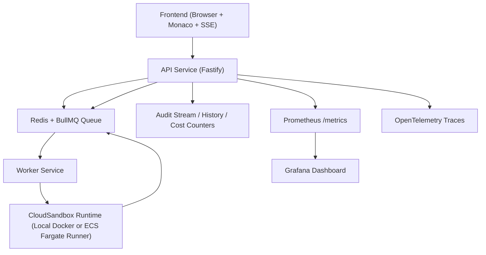

# Architecture

## Problem Statement
Developers need a safe way to run untrusted code with fast feedback. A synchronous API model fails under bursts, has poor isolation, and cannot enforce fair usage.

## Solution Overview
CloudSandbox separates control-plane API operations from asynchronous execution workers. Jobs are queued, executed in isolated runtimes, and exposed through status polling and event-stream endpoints.

## Request Lifecycle
1. User submits code from the web editor.
2. API authenticates tenant and validates payload size/language/limits.
3. API enforces per-tenant request and submit burst limits.
4. API reserves quota (`maxConcurrentJobs`, `maxDailyJobs`) and enqueues the job.
5. Worker consumes the queue, marks job `running`, and dispatches sandbox execution.
6. Runner executes code with CPU/memory/process/file/time constraints.
7. Result and logs are persisted; quota/cost counters are updated.
8. Frontend polls for status changes until terminal (`succeeded`, `failed`, `timed_out`).

## Public API Surface
- `POST /executions` (alias of `POST /v1/jobs`)
- `GET /executions/:id` (alias of `GET /v1/jobs/:jobId`)
- `GET /executions/:id/logs`
- `GET /executions/:id/events`
- `POST /executions/:id/analyze` (AI/heuristic execution explanation)
- `GET /executions` (history alias)
- `GET /v1/runtimes`
- `GET /v1/observability/summary`
- `GET /metrics`

## Why Queue-Based Execution
- Decouples API latency from runtime latency.
- Supports burst absorption and backpressure.
- Enables horizontal worker scaling without API saturation.
- Makes retry and dead-letter patterns feasible.

## CloudSandbox Runtime Matrix
- Java: compile with `javac`, run on Eclipse Temurin JDK 25.0.3 with memory-bound heap.
- Python: run with `python3`.
- Go: compile with `go build`, execute bounded native binary.
- JavaScript: run with Node.js 24.16.0 LTS.
- TypeScript: compile with `tsc`, run emitted JavaScript with Node.js 24.16.0 LTS.
- C++: compile with GCC 14.2 using C++23, execute bounded native binary.
- C#: compile with `mcs`, run with Mono.

## Observability
- OpenTelemetry spans track API requests plus worker queue-processing spans with tenant, job, language, backend, attempt, result, and ECS task metadata.
- Prometheus scrapes `/metrics` for jobs per second, average runtime, failure rate, queue depth, and worker utilization.
- Grafana is provisioned locally with a CloudSandbox dashboard.
- Server-Sent Events stream job status changes to browser clients without aggressive polling.
